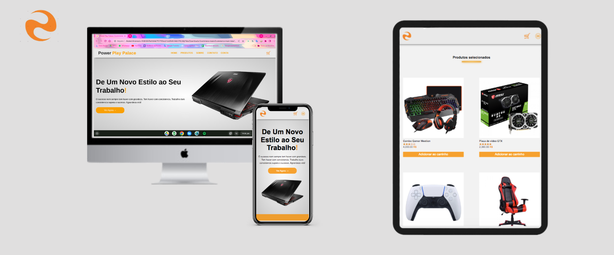

# Em desenvolvimento.....
<h1 align="center">
   
Power Play Palace

</h1>

<h4 align="center"><a href="https://praticode.com">Clique para visitar o projeto</a></h4>

## 📚 Seções

O site é composto por cinco seções:

- **Home:** Nele temos alguns anuncios de produtos;
- **Produtos:** Nessa seção temos os produtos divididos por suas sub categorias em uma vitrine;
- **Sobre:** Apresenta quem somos;
- **Contato:** Nessa seção contem as formas de como nos contactar;
- **Conta:** Nessa seção temos a area do usuario;

## 📂Tecnologias utilizadas

Para o desenvolvimento deste site utilizei as seguintes tecnologias:

- HTML;
- CSS;
- PHP;
- SQL;
- API;
- Java Script;
- SVG.

## 🌐 Plataforma utilizadas
Para desenvolvimento deste site utilizamos algumas plataformas que nos auxiliaram nos conceitos de desing:

- https://www.canva.com;
- https://www.remove.bg;
- https://www.figma.com;
- https://www.tawk.to;
- https://getbootstrap.com;
- https://www.w3schools.com;
- https://manage.wix.com.
  
<h2>Dev</h2>

<table>
  <tr>
    <td align="center">
      <a href="https://github.com/Kevenferraz39">
           
        
          <b>Keven Ferraz</b>
        
      </a>
    </td>
  </tr>
</table>
